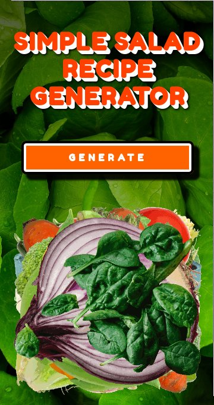

# Simple Salad Recipe Generator

## Generate a simple three ingredient salad recipe saved to a PDF file.

## A mobile first, responsive recipe generator created using Javascript ES6, jsPDF, HTML, and CSS.

## https://iambw.github.io/simplesaladrecipegenerator

## Built with

* Javascript ES6

* [JSPDF](https://parall.ax/products/jspdf)

* [Babel](https://babeljs.io/docs/en/)

* HTML5

* CSS3

## License

This project is licensed under the GPL-3.0 License.
