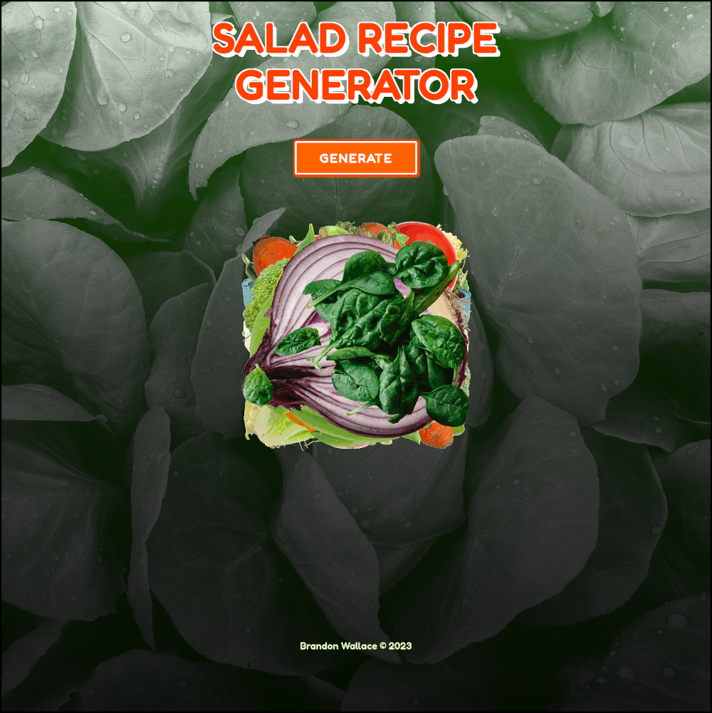
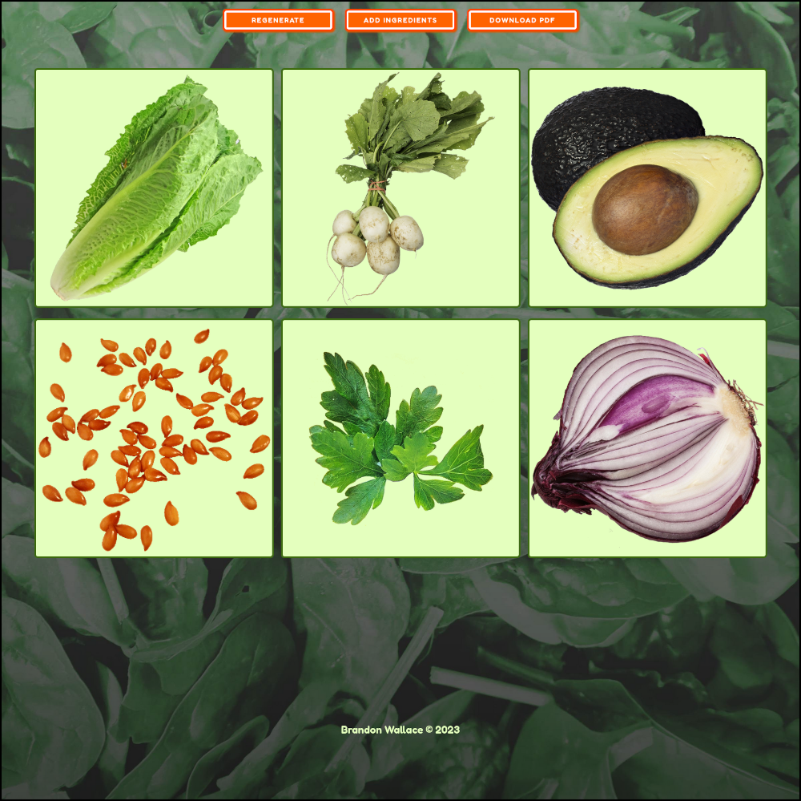

# Simple Salad Recipe Generator

# Generate a simple three - six ingredient salad recipe saved to a PDF file.

# A mobile first, responsive recipe generator created using Javascript, jsPDF, HTML, and CSS.

# https://salad-recipe.surge.sh

# Features:

* Mobile First, responsive Design

* Made with Javascript, [JSPDF](https://parall.ax/products/jspdf), HTML5, CSS3








1. Clone project.
```
git clone https://github.com/brandon-wallace/saladgenerator.git
```

2. Run a server in the project directory.
```
$ cd saladgenerator/

$ python3 -m http.server 8000

```

3. Browse to http://127.0.0.1:8000.


# License

This project is licensed under the GPL-3.0 License.
